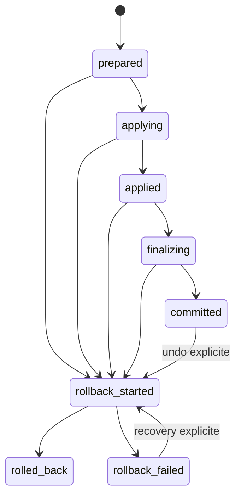

# OpticCode - Apply transactionnel

Derniere mise a jour : 2026-07-11

Statut : `APPLY-001` implemente et valide sur fixtures Git temporaires.

## Objectif et perimetre

Cette brique rend l'application de fichiers recuperable et observable. Elle ne
rend pas OpticCode autonome et n'autorise aucun shell arbitraire.

Le moteur transactionnel est generique sur trois mutations :

- creer un fichier ;
- remplacer un fichier ;
- supprimer un fichier.

Le generateur legacy actuel utilise seulement le remplacement de fichiers
texte. Le moteur conserve cependant les contenus en octets et peut sauvegarder
des donnees binaires sans conversion de fin de ligne.

Aucun test de ce sprint n'a modifie Kspawners, PandaSpigot ou un autre projet
personnel original. Tous les tests d'ecriture utilisent des depots temporaires.

## Invariants retenus

1. Le patch, le manifeste, toutes les sauvegardes et l'evenement `prepared`
   sont publies avant la premiere ecriture cible.
2. Chaque transaction a un identifiant ASCII valide, unique dans le workspace.
3. Une transaction existante et ses artefacts ne sont jamais ecrases.
4. Chaque transition est append-only et une transition impossible est refusee.
5. Chaque sauvegarde est verifiee par taille et BLAKE3 avant recuperation.
6. Chaque fichier est revalide juste avant son ecriture.
7. Une erreur apres preparation declenche un rollback automatique.
8. Un rollback incomplet finit en `rollback_failed`, jamais en succes.
9. Un rollback refuse d'ecraser un contenu qui ne correspond ni a l'etat avant,
   ni a l'etat applique par la transaction.
10. Un rollback reussi restaure les octets, le mode lecture seule et, sous Unix,
    le mode de permissions enregistre.
11. L'etat Git avant transaction est compare apres rollback, hors `.opticcode`.
12. La recuperation d'une transaction incomplete reste explicite et confirmee.
13. Un verrou OS unique par workspace interdit deux apply/recovery OpticCode concurrents.
14. Aucune commande globale destructive telle que `git reset --hard` ou
    `git clean -fd` n'est utilisee.

## Architecture

Implementation principale :

```text
crates/opticcode-tools/src/apply_transaction.rs
crates/opticcode-tools/src/apply_transaction/windows.rs
```

Integration :

```text
PatchProposal
  -> git apply --check
  -> FileMutation avec before/after exacts
  -> ApplyTransactionRequest
  -> execute_apply_transaction
  -> ApplyTransactionResult
  -> index de compatibilite apply-log.jsonl
```

Le journal transactionnel est la source de verite. Le fichier historique
`.opticcode/apply-log.jsonl` n'est plus qu'un index secondaire. Son echec apres
commit produit un avertissement mais n'efface pas la transaction autoritaire.

## Etats



`committed` et `rolled_back` sont terminaux pour leur operation respective.
`rollback_failed` reste inspectable et recuperable si le manifeste, les
evenements et les sauvegardes sont valides.

## Stockage

```text
<workspace>/.opticcode/
  apply-log.jsonl
  runs/
    <transaction-id>/
      patch.diff
      manifest.json
      backups/
        00000000.bin
        00000001.bin
      events/
        00000000-prepared.json
        00000001-applying.json
        00000002-applied.json
        00000003-finalizing.json
        00000004-committed.json
```

Le manifeste versionne contient notamment :

- `schema_version` ;
- identifiant, workspace canonique et date de creation ;
- hash BLAKE3 et chemin fixe du patch ;
- politique et snapshot Git avant application ;
- liste ordonnee des fichiers ;
- existence, taille, BLAKE3 et permissions avant application ;
- taille et BLAKE3 de l'etat attendu apres application ;
- chemin fixe de chaque sauvegarde.

Chaque evenement contient l'etat, la sequence, la duree, les fichiers, les
erreurs et, quand utile, un snapshot Git. Les evenements ne sont jamais
reecrits : chaque transition cree un nouveau JSON.

## Deroulement d'un apply

1. Canonicaliser le workspace et valider les chemins relatifs.
2. Refuser symlinks, jonctions/reparse points, doublons, chemins `.opticcode` et parents externes.
3. Pour `require_clean`, effectuer un preflight Git sans ecriture.
4. Acquerir `.opticcode/apply.lock`, verrou OS conserve pendant toute l'operation.
5. Recapturer Git sous verrou et appliquer la politique `require_clean`, `allow_dirty` ou
   `optional` pour une copie.
6. Creer exclusivement le dossier de transaction.
7. Ecrire et synchroniser `patch.diff`.
8. Ecrire et synchroniser chaque backup brut.
9. Ecrire et synchroniser `manifest.json`.
10. Append l'evenement `prepared`.
11. Stager le temporaire, puis revalider chemin et contenu juste avant publication.
12. Remplacer, creer ou supprimer chaque fichier, puis verifier son BLAKE3.
13. Reverifier fichiers et changements Git externes avant `committed`.
14. Append `applied`, `finalizing`, puis `committed`.
15. En cas d'erreur apres preparation, passer par `rollback_started`.

Il n'existe pas de transaction atomique globale sur plusieurs fichiers. Chaque
remplacement est atomique individuellement ; le journal et les backups rendent
un etat partiel detectable et recuperable.

## Rollback et recuperation

Le rollback traite les fichiers dans l'ordre inverse :

- un fichier remplace est restaure depuis son backup ;
- un fichier supprime est recree depuis son backup ;
- un fichier cree par la transaction est supprime uniquement si son hash
  correspond encore a l'etat cree ;
- un fichier deja restaure est accepte, ce qui rend la reprise idempotente ;
- un contenu externe inconnu n'est jamais ecrase silencieusement.

Apres chaque restauration, le contenu est reverifie par BLAKE3. L'etat Git est
ensuite recapture et compare au snapshot initial, y compris quand le depot etait
sale avec autorisation explicite.

L'inspection refuse la recuperation si :

- le manifeste ou un evenement est absent, tronque ou incoherent ;
- le patch ne correspond plus a son BLAKE3 ;
- une sauvegarde manque ou ne correspond plus a sa taille/BLAKE3 ;
- une transition ou une sequence est impossible ;
- le workspace ou l'identifiant ne correspond pas au journal.

## Politique Git

Apply reel par defaut :

```text
require_clean
```

Le depot Git est obligatoire et tout changement hors `.opticcode` provoque un
refus avant creation du dossier de transaction.

Exception explicite :

```powershell
cargo run -q -- apply --path C:\projet --allow-external --allow-dirty --yes
```

Le snapshot sale est alors conserve. Un rollback n'est valide que si ce meme
travail preexistant est toujours present apres restauration.

Le mode `--copy-to` utilise une politique Git optionnelle, car la source reste
intacte et seule la copie controlee est modifiee.

## Atomicite et durabilite Windows

Les contenus critiques sont d'abord ecrits dans un fichier temporaire du meme
dossier avec `create_new`, puis `flush` et `sync_all` avant publication.

Sous Windows :

- `MoveFileExW` sans remplacement publie les nouveaux artefacts avec
  `MOVEFILE_WRITE_THROUGH` ;
- `ReplaceFileW` remplace un fichier existant et preserve autant que possible
  ses attributs/ACL ;
- le drapeau `REPLACEFILE_WRITE_THROUGH` n'est pas utilise car Microsoft le
  documente comme non pris en charge ;
- un handle ouvert, un antivirus, les ACL ou un fichier en lecture seule peuvent
  faire echouer le remplacement ; cette erreur declenche le rollback ;
- `std` ne fournit pas de synchronisation portable d'un handle de repertoire
  Windows. Le contenu temporaire est synchronise, mais la persistance absolue de
  la metadata du renommage apres coupure brutale ne peut pas etre promise ;
- les chemins Unicode et avec espaces sont testes ; les chemins longs restent
  soumis a la configuration Windows `longPathAware`/MAX_PATH.

References :

- [Microsoft ReplaceFileW](https://learn.microsoft.com/en-us/windows/win32/api/winbase/nf-winbase-replacefilew)
- [Microsoft MoveFileExW](https://learn.microsoft.com/en-us/windows/win32/api/winbase/nf-winbase-movefileexw)
- [Microsoft FlushFileBuffers](https://learn.microsoft.com/en-us/windows/win32/api/fileapi/nf-fileapi-flushfilebuffers)

## CLI

Application sur depot propre :

```powershell
cargo run -q -- apply --path C:\projet --allow-external --yes --json
```

Undo explicite :

```powershell
cargo run -q -- apply --path C:\projet --undo <id> --allow-external --yes --json
```

Lister et inspecter :

```powershell
cargo run -q -- transactions --path C:\projet --json
cargo run -q -- transactions --path C:\projet --inspect <id> --json
```

Recuperer une transaction incomplete apres resolution de la cause :

```powershell
cargo run -q -- transactions --path C:\projet --recover <id> --allow-external --yes --json
```

La liste et l'inspection sont read-only. `--recover` exige `--yes` et le verrou
`--allow-external` hors du workspace courant.

Codes de sortie transactionnels :

| Code | Signification |
| ---: | --- |
| 0 | operation reussie |
| 2 | apply en echec, rollback reussi |
| 3 | rollback incomplet ou echoue |
| 4 | precondition refusee |
| 5 | transaction, journal ou artefact invalide |

Les resultats Serde exposent `schema_version`, `transaction_id`,
`operation_success`, `final_state`, `rollback_attempted`, `rollback_success`,
les fichiers prevus/modifies/restaures, les erreurs, avertissements, duree et
verification Git.

## Injections de panne

Le mecanisme est interne aux tests et n'est pas expose dans le CLI de production.

| Point | Preuve attendue |
| --- | --- |
| apres le premier backup | aucune cible modifiee, run incomplet detectable |
| apres `prepared` | rollback sans modification residuelle |
| avant la premiere ecriture | erreur de permission simulee, original intact |
| apres staging du temporaire | modification externe detectee avant publication |
| apres la premiere ecriture | rollback exact |
| apres toutes les ecritures | rollback exact |
| avant finalisation | rollback exact |
| pendant finalisation | rollback exact |
| debut du rollback | `rollback_failed`, recuperation possible |
| apres la premiere restauration | rollback partiel, seconde reprise idempotente |

## Validation reproductible

Validation ciblee :

```powershell
.\scripts\run-apply-transaction-quality.ps1
```

Validation complete :

```powershell
.\scripts\run-apply-transaction-quality.ps1 -Full
```

La matrice ciblee couvre succes mono/multi-fichiers, create/modify/delete,
depot propre/sale, collision, verrou concurrent, patch invalide, journaux
tronque/duplique/reordonne/contradictoire, backup corrompu, symlinks/jonctions,
chaque injection de panne, rollback partiel, seconde recuperation, binaire,
BLAKE3, Unicode, espaces, LF/CRLF et sorties/codes `0/2/3/4/5` du vrai binaire.

Resultat exact du dernier run `-Full` le 2026-07-11 :

- `cargo fmt --all -- --check` : OK ;
- `cargo clippy --workspace --all-targets --all-features -- -D warnings` : OK ;
- `cargo test --workspace` : 96 tests passes, 0 echec, 0 ignore ;
- `cargo build --workspace --release` : OK ;
- regressions Git State Guard, process runner et patch legacy : OK ;
- tests transactionnels cibles : 27 internes + 4 CLI, tous OK.

## Limites restantes

- Le verrou coordonne les processus OpticCode, pas un editeur ou processus externe.
- Une course externe reste theoriquement possible dans l'intervalle systeme minimal
  entre la derniere relecture et `ReplaceFileW`/rename ; les controles avant/apres
  la detectent autant que les API par chemin le permettent.
- Pas d'atomicite globale multi-fichiers ; la garantie est apply ou recovery.
- Pas de creation/suppression automatique de repertoires parents.
- Pas de signature anti-tampering ; BLAKE3 detecte l'integrite accidentelle,
  pas un attaquant local qui reecrit manifeste et backups ensemble.
- Pas de build inclus dans la meme transaction.
- Pas encore de budget maximal de fichiers/octets par apply.
- Le generateur historique `patch/apply` reste textuel ; B3 convertit des edits
  AST fiables en transactions uniquement dans un worktree.
- Une transaction invalide avant `prepared` est inspectable mais pas recuperee
  automatiquement, car aucune cible n'a encore ete modifiee.

## Suite recommandee

`GIT-002` est maintenant termine ; voir
[`worktree-verification.md`](worktree-verification.md). Tree-sitter Java et
l'index inter-fichiers, B2 et le pipeline B3 sont aussi termines. Voir
[`java-edit-worktree.md`](java-edit-worktree.md). LEGACY-002 et CONTEXT-001 sont
egalement termines ; voir [`java-legacy-rules.md`](java-legacy-rules.md) et
[`java-context.md`](java-context.md). La priorite suivante est `CONTEXT-002`,
integration A/B du contexte symbolique dans `ask` et `plan`.
