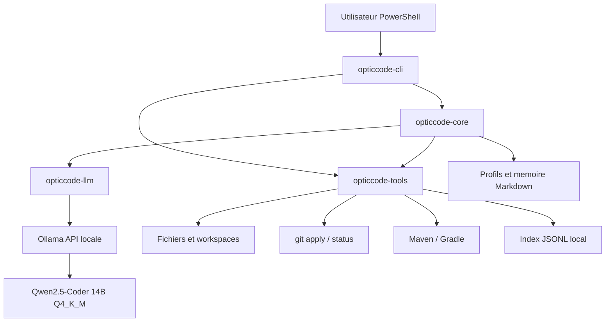

# OpticCode - Audit complet du projet

Date de l'audit : 2026-07-11

Depot audite : `C:\Users\timot\Desktop\OpticCode`

Base Git au debut de l'audit : `bf550ed626891c8202ccf6e30e70d1da8984035b`

Mise a jour apres audit : le sprint `Build Git State Guard` recommande dans la
section 16 a ete implemente le 2026-07-11. Voir
[`build-git-state-guard.md`](build-git-state-guard.md). Le process runner borne
a ensuite ete implemente.

Durcissement supplementaire termine le meme jour : BLAKE3, metriques de
snapshot, commande read-only `git-state`, test CLI Rust, test des fichiers
ignores et benchmark PandaSpigot. Le backlog courant est consolide dans
[`optimization-backlog.md`](optimization-backlog.md). Voir aussi
[`process-runner.md`](process-runner.md) pour le timeout, la capture bornee et le
Job Object Windows valides avant l'apply transactionnel.

Mise a jour APPLY-001 : l'apply transactionnel est maintenant implemente avec
journal `prepared`, backups BLAKE3, etats append-only, rollback automatique,
recovery explicite, concurrence optimiste et tests CLI reels. Voir
[`apply-transaction.md`](apply-transaction.md). GIT-002, alors cible suivante de
l'audit, est maintenant termine dans la mise a jour ci-dessous.

Validation post-audit : fmt et Clippy stricts OK, 96 tests workspace passes,
build release OK. Les tests APPLY-001 utilisent uniquement des fixtures Git
temporaires.

Mise a jour du 2026-07-13 : GIT-002 est implemente dans un module separe avec
worktree detache, apply transactionnel, build strict borne, diff, preuve de
source inchangee, cleanup valide et leases recuperables. La validation courante
atteint 105 tests workspace et Clippy strict sans avertissement. Voir
[`worktree-verification.md`](worktree-verification.md). La prochaine cible est
`CODE-001`, Tree-sitter Java.

Mise a jour CODE-001 du 2026-07-13 : une baseline Tree-sitter Java read-only est
disponible dans un module separe avec symboles, references, positions, zones
non-code et diagnostics structures. Les essais read-only couvrent mini Bukkit,
Kspawners et 500 fichiers selectionnes parmi 8 933 dans PandaSpigot. Cette
baseline seule atteignait 114 tests workspace, Clippy strict et build release
OK, puis conduisait a `CODE-001B1`. Voir [`java-syntax.md`](java-syntax.md).

Mise a jour CODE-001B1 du 2026-07-13 : l'index Java inter-fichiers read-only est
disponible avec identifiants stables, overloads, imports, resolution bornee et
incertitude explicite. La CLI expose `java-index`; les mesures couvrent un corpus
multi-fichiers, Kspawners et jusqu'a 5 000 fichiers PandaSpigot. La prochaine
cible est `CODE-001B2`, edits read-only sur ranges AST verifies. La validation
courante atteint 120 tests workspace. Voir [`java-index.md`](java-index.md).

Mise a jour CODE-001B2 du 2026-07-13 : le moteur `java_edits/` produit des
propositions read-only avec cible exacte, hash BLAKE3, noeud et octets attendus,
garde anti-shadow, ranges non chevauchants et reparse en memoire. Le corpus de
plus de 50 cas couvre 14/14 regles avec 16 edits attendus et zero faux positif.
Sur Kspawners, `CreatureSpawnEvent.SpawnReason.SPAWNER` est correctement refuse
comme mauvaise cible. La prochaine cible est `CODE-001B3`, execution
transactionnelle uniquement dans un worktree. Voir
[`java-edits.md`](java-edits.md). La validation workspace atteint maintenant
132 tests, Clippy strict sans avertissement et build release reussi.

## 1. Resume executif

OpticCode n'est plus une simple idee ni un assemblage de documentation. Le depot contient un MVP Rust fonctionnel capable de :

- inspecter un workspace local ;
- rechercher du texte ;
- construire un contexte projet borne ;
- analyser un projet Maven/Gradle Bukkit de facon deterministe ;
- appeler Qwen2.5-Coder 14B via Ollama ;
- charger un profil Minecraft Java 1.8 et une memoire Markdown ;
- construire et interroger un index RAG JSONL local ;
- proposer et verifier des corrections legacy deterministes ;
- produire des edits Java cibles read-only avec preconditions verifiables ;
- appliquer ces corrections avec confirmation, transaction, rollback et recovery ;
- compiler un projet Java et resumer certaines erreurs ;
- mesurer la latence, les tokens Ollama et la qualite de scenarios repetables.

Le projet est toutefois encore un MVP technique. Ce n'est pas encore un agent code autonome capable de choisir ses outils, generer un patch arbitraire, compiler, diagnostiquer et iterer sans intervention.

Verdict global :

| Axe | Etat audite | Verdict |
| --- | --- | --- |
| Cadrage et architecture | solide | la direction Rust + Ollama puis llama.cpp reste coherente |
| Environnement Windows | operationnel | aucun nouvel outil lourd n'est requis maintenant |
| CLI locale | fonctionnelle | commandes specialisees et sorties JSON versionnees |
| Specialisation Bukkit 1.8 | utile mais etroite | bonnes premieres regles, couverture encore faible |
| RAG | prototype valide | utile sur les cas legacy, pas encore scalable |
| Safe apply | transactionnel | rollback/recovery valides, adaptateur B2 vers worktree encore absent |
| Agent iteratif | non commence | aucune boucle autonome de tools/build/correction |
| Performance | mesuree | inference Qwen dominante, outils locaux rapides |
| Qualite logicielle | bonne base | tests et lint verts, CI et couverture absentes |
| Niveau produit | experimental | pas de release, configuration stable, TUI, daemon ou IDE |

Position actuelle dans le plan : Phase 5.4 terminee pour le worktree jetable.
Les projets personnels originaux restent hors tests. Le worktree jetable et la
   baseline Tree-sitter, index B1 et edits B2 sont valides ; la prochaine cible est CODE-001B3.

## 2. Portee et methode de l'audit

L'audit a couvert :

- l'etat Git et les 36 commits existants ;
- les 56 fichiers suivis au debut de l'audit ;
- les quatre crates Rust et leurs dependances ;
- les commandes publiques de la CLI ;
- les profils, memoires et regles legacy ;
- le pipeline RAG JSONL ;
- le pipeline patch, apply, journal et undo ;
- les scripts de benchmark ;
- l'index local actuel ;
- l'environnement Windows, Java et Ollama visible le jour de l'audit ;
- les tests unitaires, le lint, le build release et le benchmark patch/build.

Regles respectees pendant l'audit :

- aucun projet externe original n'a ete modifie ;
- aucun resource pack n'a ete deplace ou copie ;
- aucun plugin personnel et aucun fichier PandaSpigot n'a ete modifie ;
- les artefacts de test ont ete crees uniquement sous `benchmarks/runs/`, ignore par Git ;
- aucun depot supplementaire n'a ete clone ;
- aucun outil lourd n'a ete installe.

Limites de cet audit :

- le benchmark LLM complet avec/sans RAG n'a pas ete relance le 2026-07-11 ;
- le modele etait installe mais non charge au moment de la verification ;
- `cargo-audit` n'est pas installe, donc aucun scan CVE Rust automatise n'a ete execute ;
- aucune mesure de couverture de code n'est disponible ;
- llama.cpp, Q5_K_M, HIP et ROCm n'ont pas ete testes ;
- les licences et versions des depots externes n'ont pas ete reverifiees en ligne pendant cet audit local.

## 3. Vision conservee

La vision reste techniquement coherente :

```text
OpticCode
  = modele code local deja entraine
  + contexte projet selectionne
  + connaissances Minecraft legacy
  + outils deterministes
  + patchs controlables
  + build/test
  + memoire projet
  + boucle agent bornee
```

Le projet ne doit pas :

- entrainer un modele depuis zero ;
- modifier Qwen ou le format GGUF ;
- reecrire llama.cpp ;
- injecter une codebase complete dans chaque prompt ;
- appliquer silencieusement des changements ;
- installer Qdrant, Docker ou une pile C++ avant qu'une mesure ne le justifie.

La specialisation Minecraft Java 8 est un avantage produit. Elle doit rester dans des profils, regles, index et validateurs testables, pas dans un preprompt geant impossible a maintenir.

## 4. Etat quantitatif du depot

### 4.1 Git et fichiers

| Mesure | Valeur au 2026-07-11 |
| --- | ---: |
| Commits avant audit | 36 |
| Branche | `master` |
| Remote Git | aucun configure |
| Fichiers suivis avant audit | 56 |
| Objets Git non empaquetes | 1 533, environ 3,09 Mio |
| Workflow CI | absent |
| Fichier `LICENSE` | absent |
| Fichier `.gitattributes` | absent |

Le manifeste declare `MIT`, mais l'absence de fichier `LICENSE` devra etre corrigee avant publication. Le champ `repository` pointe encore vers `https://github.com/local/opticcode`, qui est un placeholder.

### 4.2 Code Rust

| Fichier | Lignes | Role actuel |
| --- | ---: | --- |
| `opticcode-tools/src/lib.rs` | 3 296 | inspection, Java, build, RAG, patch, apply, copie, affichage |
| `opticcode-core/src/lib.rs` | 1 202 | orchestration prompt, profil, memoire, RAG |
| `opticcode-cli/src/main.rs` | 609 | parsing CLI, dispatch, garde-fous externes, metriques |
| `opticcode-llm/src/lib.rs` | 186 | client Ollama `/api/generate` |
| Total | 5 293 | hors scripts et benchmarks Java |

Le ratio montre une dette claire : `opticcode-tools` contient environ 62 % du code Rust et cumule trop de responsabilites. Il reste testable aujourd'hui, mais doit etre decoupe avant d'ajouter Tree-sitter, Tantivy et une boucle agent.

### 4.3 Dependances

Dependances directes principales :

- `anyhow` pour les erreurs ;
- `clap` pour la CLI ;
- `reqwest` et `tokio` pour Ollama ;
- `serde`, `serde_json` et `serde_yaml` ;
- `roxmltree` pour Maven ;
- `walkdir` pour les scans.

Constats :

- `cargo tree --duplicates` ne remonte aucun doublon utile a signaler ;
- le `Cargo.lock` contient 175 packages, plateformes comprises ;
- `serde_yaml 0.9.34+deprecated` est marque deprecated et devra etre remplace ou encapsule ;
- aucun `rust-version` minimal n'est declare ;
- `reqwest` utilise ses fonctions TLS par defaut alors qu'Ollama est actuellement contacte en HTTP local ;
- aucun outil de controle de licences ou vulnerabilites n'est integre.

### 4.4 Binaire

Le build release du jour a produit :

```text
target/release/opticcode.exe
taille : 4 495 872 octets, environ 4,29 Mio
```

Cette taille est correcte pour un CLI Rust incluant HTTP/TLS. Elle n'est pas une priorite d'optimisation.

## 5. Environnement reel au jour de l'audit

| Element | Etat audite |
| --- | --- |
| Windows | Windows 10 Famille 64 bits, build 19045 |
| CPU / RAM | Ryzen 7 3700X, environ 32 Go |
| GPU | AMD Radeon RX 9060 XT, configuration annoncee 16 Go |
| Git | 2.51.0.windows.1 |
| Rust / Cargo | 1.94.0 |
| CMake | 4.3.4 |
| Ninja | 1.13.2 |
| Java / javac | Temurin 1.8.0_482 |
| Maven | 3.9.9, execute avec Java 8 |
| Ollama | 0.31.2 |
| Modele | `qwen2.5-coder:14b`, 9,0 Go |
| Modele charge pendant audit | non |

La documentation d'environnement indique encore Ollama 0.31.1. Elle est donc legerement datee, sans impact fonctionnel.

La valeur `AdapterRAM` exposee par WMI n'est pas fiable pour une carte de 16 Go car cette propriete Windows peut tronquer ou saturer. Elle ne doit pas servir a mesurer la VRAM. Les futurs benchmarks GPU devront utiliser les metriques du runtime ou un outil AMD adapte.

## 6. Architecture actuelle



### 6.1 Points sains

- La CLI ne contient pas le moteur LLM.
- Le provider Ollama est isole dans une crate.
- Les operations dangereuses passent par des fonctions deterministes.
- Le RAG est local et les donnees volumineuses sont ignorees par Git.
- Le profil metier est un fichier modifiable, pas un prompt compile en dur uniquement.
- Les appels LLM et les outils locaux peuvent etre testes separement.

### 6.2 Points a restructurer

- `opticcode-tools` doit devenir plusieurs modules internes avant de devenir plusieurs crates.
- `opticcode-core` appelle directement des fonctions concretes au lieu d'interfaces de provider et de tools.
- Il n'existe pas de registre de tools, de politique d'autorisation generique ni de journal agent.
- Il n'existe pas de configuration unifiee projet/utilisateur.
- Les sorties humaines dominent ; peu de commandes ont un format JSON stable.

Decoupage interne recommande avant Phase 7 :

```text
opticcode-tools
  workspace.rs
  search.rs
  java_analysis.rs
  build.rs
  patch.rs
  apply.rs
  worktree.rs
  rag_scan.rs
  rag_index.rs
  git_state.rs
```

Ce decoupage n'exige pas de multiplier immediatement les crates. Il doit d'abord reduire le couplage et faciliter les tests d'integration.

## 7. Fonctionnalites disponibles

La CLI expose maintenant 22 commandes :

| Domaine | Commandes | Etat |
| --- | --- | --- |
| Workspace | `inspect`, `git-state`, `search`, `context` | fonctionnel |
| Java | `analyze-java`, `java-syntax`, `java-index`, `build` | index inter-fichiers read-only ajoute |
| Connaissances | `profile`, `memory` | lecture seule fonctionnelle |
| Sources | `pack-scan`, `rag-scan` | lecture seule fonctionnelle |
| RAG | `rag-index`, `rag-search`, `rag-debug` | prototype fonctionnel |
| Patches | `patch`, `apply`, `transactions` | fonctionnel pour regles deterministes |
| Isolation | `worktree-verify`, `worktrees` | fonctionnel sur source Git propre |
| LLM | `ask`, `plan` | fonctionnel via Ollama |

### 7.1 Inspection et recherche

Acquis :

- parcours borne a 2 000 fichiers pour l'inspection ;
- exclusion des repertoires de build et dependances courants ;
- detection Git, Maven et Gradle ;
- recherche texte locale avec limite de resultats ;
- selection de fichiers de contexte priorisant `pom.xml`, `plugin.yml`, main, commandes et listeners.

Limites :

- le contexte est choisi selon le type de fichier, pas selon la demande utilisateur ;
- seuls huit fichiers sont pris par defaut ;
- la taille est bornee par caracteres, pas par tokens reels ;
- pas de respect de `.gitignore` generique ;
- pas de recherche `rg` native ou d'index persistant pour les workspaces larges ;
- les fichiers non UTF-8 sont ignores silencieusement.

Bornes actuelles du contexte :

| Limite | Valeur |
| --- | ---: |
| Fichiers de contexte | 8 |
| Taille par fichier | 4 Kio environ |
| Total contexte fichiers | 24 Kio environ |
| Fichier lisible maximum | 512 Kio |

### 7.2 Analyse Java/Bukkit

Acquis :

- detection Maven ou Gradle ;
- parsing XML structure de `pom.xml` ;
- parsing YAML de `plugin.yml` ;
- Java source/target 8 ;
- dependances Maven ;
- main, commandes et permissions ;
- detection textuelle de `CommandExecutor`, `Listener`, `@EventHandler` et `getCommand(...)` ;
- controles de coherence commandes Java / `plugin.yml` ;
- detection de quelques API modernes ou symboles legacy incompatibles.

Limites :

- l'analyse Java est textuelle et peut confondre code, commentaires et chaines ;
- pas de resolution de symboles, heritage, generiques ou appels indirects ;
- pas de projets Maven multi-modules ;
- parsing Maven incomplet pour `pluginManagement`, profils et proprietes imbriquees ;
- Gradle est seulement detecte, pas analyse ;
- pas de Gradle Wrapper privilegie ;
- pas de prise en charge detaillee de NMS/CraftBukkit remappe ;
- pas de compilation module par module de PandaSpigot.

### 7.3 Build controle

Commandes actuelles :

```text
Maven : mvn -q -DskipTests package
Gradle : gradle build
```

Acquis :

- duree et code de sortie ;
- fin de stdout/stderr ;
- resume de motifs Maven connus ;
- suggestion legacy pour certaines erreurs de symboles ;
- snapshot Git avant/apres et politique stricte ;
- timeout configurable, 600 secondes par defaut ;
- capture concurrente bornee a 1 Mio par flux par defaut ;
- statuts structures et rapport JSON ;
- cancellation programmatique distincte ;
- terminaison de l'arbre `cmd.exe -> mvn.cmd -> java.exe` par Job Object.

Limites critiques :

- Maven peut modifier `dependency-reduced-pom.xml` ;
- `-DskipTests` compile potentiellement les tests mais ne les execute pas ;
- aucune commande de test separee ;
- le fallback non-Windows ne termine pas encore un process group complet ;
- le build Gradle utilise `gradle` global au lieu de `gradlew` quand disponible ;
- aucune politique par projet pour les commandes autorisees.

### 7.4 Provider LLM

Acquis :

- endpoint Ollama `/api/generate` ;
- modele configurable ;
- URL configurable ;
- `keep_alive=15m` par defaut ;
- limite `num_predict` ;
- metriques client, chargement, prompt eval, generation et tokens/s ;
- sorties JSON de benchmark.

Limites :

- `stream=false` uniquement ;
- aucune mesure du temps au premier token ;
- pas de timeout HTTP explicite ;
- pas de retry borne ;
- pas de cancellation ;
- pas de health check ni validation du modele au demarrage ;
- pas de trait `LlmProvider` ;
- pas de backend OpenAI-compatible pour llama.cpp ou LM Studio ;
- pas de `/api/chat`, roles system/user ou historique structure ;
- seuls `num_predict` et `keep_alive` sont exposes ;
- temperature, seed, `num_ctx`, stop sequences et sampling ne sont pas fixes pour les tests ;
- le nombre de tokens prompt est rapporte par Ollama apres appel, pas estime avant envoi.

### 7.5 Profils et memoire

Acquis :

- profil `minecraft-java-1.8` ;
- memoire globale ;
- memoire de profil ;
- recherche dans le workspace puis dans le depot OpticCode ;
- limites strictes : 2 500 caracteres par entree et 7 000 au total.

Limites :

- pas de memoire projet generee ou mise a jour par commande ;
- pas de provenance/validation des regles apprises ;
- pas de feedback accepte/refuse ;
- pas de schema ni version ;
- plusieurs regles sont dupliquees entre prompt, profil, memoire et documentation ;
- la mise a jour manuelle peut creer des contradictions.

### 7.6 RAG local

Index actuel sous `data/index/` :

| Mesure | Valeur |
| --- | ---: |
| Sources | 6 lors du dernier build documente |
| Documents | 2 651 |
| Chunks | 5 063 |
| `documents.jsonl` | 814 305 octets |
| `chunks.jsonl` | 14 118 571 octets |

Acquis :

- scan en lecture seule ;
- filtres de dossiers ;
- metadata, hash de contenu et type de source ;
- chunking local ;
- recherche lexicale ;
- expansion de requetes legacy francais/anglais ;
- score pondere ;
- priorite docs/profils/plugins/resource packs/PandaSpigot ;
- deduplication et filtre anti-bruit ;
- debug sans appel modele ;
- contexte RAG limite a six hits et 4 500 caracteres.

Limites structurelles :

- chaque recherche relit tout `chunks.jsonl` ;
- une requete elargie provoque plusieurs parcours complets de l'index ;
- le score exige tous les termes pour une requete multi-mots ;
- pas de tokenisation linguistique ni BM25 ;
- chunking au nombre de caracteres, sans frontieres de methodes/classes ;
- pas de chevauchement entre chunks ;
- pas d'index incremental ;
- reconstruction complete et ecriture directe des fichiers cibles ;
- pas de manifeste de schema/version/source ;
- pas de detection des fichiers supprimes entre deux indexations ;
- pas de recherche symbolique ;
- pas d'embeddings ni de reranking ;
- les chemins absolus des sources sont stockes dans l'index local.

Le JSONL est un bon prototype et a valide le besoin. Il ne doit pas devenir l'architecture finale pour PandaSpigot et une grosse base documentaire. Tantivy doit etre l'etape suivante avant Qdrant.

### 7.7 Regles Minecraft legacy

Corrections deterministes codees :

- `Material.GUNPOWDER` vers `Material.SULPHUR` ;
- `Material.NETHER_WART` vers `Material.NETHER_STALK` ;
- `Material.SPAWNER` et `MONSTER_SPAWNER` vers `MOB_SPAWNER` ;
- `Material.SPAWN_EGG` vers `Material.MONSTER_EGG` ;
- pelles modernes vers `*_SPADE` ;
- trois renommages `EntityType` : piglin, mooshroom et snow golem.

Cette table est utile mais encore tres petite face a Bukkit 1.8.8 :

- metadata/data values blocs et items ;
- noms de sons, particules, enchantements et potions ;
- noms d'entites et IDs legacy ;
- NMS `v1_8_R3` ;
- mappings Mojang/Spigot/PandaSpigot ;
- differences 1.8.8/1.8.9 ;
- evenements et API supprimes/renommes ;
- serialisation d'items et NBT.

Les resource packs donnent des indices de noms, pas une preuve suffisante pour les enums Bukkit. Les futures regles doivent citer leur source et avoir un test de compilation ou une verification JavaDoc.

### 7.8 Patch et safe apply

Acquis :

- preview sans ecriture ;
- `git apply --check` ;
- dry-run ;
- application sur copie ;
- application locale avec `--yes` ;
- application externe avec `--allow-external`, Git requis et propre ;
- journal transactionnel prepare avant ecriture ;
- manifeste, patch et backups bruts BLAKE3 ;
- etats append-only jusqu'a commit ou rollback ;
- rollback automatique et recovery explicite ;
- undo par `run-id` avec verification before/after ;
- validation du `run-id` ;
- conservation LF/CRLF ;
- support create/modify/delete dans le moteur ;
- repo Git propre par defaut et `--allow-dirty` explicite ;
- listing/inspection read-only des transactions ;
- JSON versionne et codes de sortie distincts ;
- refus d'une cible de copie existante ou situee sous la source.

Risques restants :

1. Le remplacement Java est un `String::replace` global. Il peut modifier un commentaire, une chaine ou un identifiant inattendu.
2. Le generateur de diff maison suppose essentiellement des remplacements ligne a ligne. Il n'est pas pret pour des insertions, suppressions ou refactors generaux.
3. Le verrou OS serialise OpticCode, mais ne bloque pas les editeurs/processus externes.
4. L'atomicite est par fichier ; un crash multi-fichiers exige la recovery journalisee.
5. Le workspace autorise est base sur le repertoire courant du processus, pas sur une racine OpticCode configuree.
6. La copie reproduit encore tout le projet, y compris `.git`, builds et gros dossiers.
7. Aucun budget de nombre de fichiers ou d'octets modifies n'est impose.
8. Aucun build automatique n'est inclus dans la transaction apply.
9. Sous Windows, la metadata de remplacement ne peut pas etre synchronisee de facon absolument portable.

Verdict mis a jour : safe apply est transactionnel et la verification en
worktree jetable existe. L'usage sur originaux reste volontairement differe tant
que le patch Java est textuel et qu'aucune promotion controlee n'est implementee.

## 8. Donnees externes deja etudiees

Sources personnelles scannees en lecture seule :

- `Kanneau` ;
- `Kchat` ;
- `Kclassement` ;
- `Kcraft` ;
- `Kfaction` ;
- `Kgui` ;
- `KjobsUltimate` ;
- `Kminerai` ;
- `Kspawners` ;
- `Kenchantement` ;
- fork PandaSpigot ;
- resource pack legacy 1.8 ;
- pack custom Volkaria.

PandaSpigot represente environ 10 031 fichiers texte indexables et 44,9 Mo d'apres le dernier inventaire. Il confirme que la lecture lineaire du JSONL ne sera pas suffisante a long terme.

Le test reel le plus avance a ete effectue sur une copie de Kspawners :

- analyse OK ;
- build Maven OK avant patch ;
- detection de `api-version` ;
- patch/check/apply OK ;
- build OK apres apply ;
- undo OK ;
- preservation CRLF OK ;
- original non modifie ;
- bruit Maven restant sur `dependency-reduced-pom.xml`.

## 9. Performance et consommation de tokens

### 9.1 Mesures historiques valides

| Scenario | Temps observe | Commentaire |
| --- | ---: | --- |
| outils Rust locaux | moins de 1 s | inspect/search mini projet |
| build Maven mini projet | environ 2,7 a 5,5 s | selon cache |
| plan long chaud | environ 25 a 26 s | 645 tokens sur un run |
| plan bref chaud | environ 5,9 a 6,4 s | 114 tokens sur un run |
| plan bref modele froid | environ 77,8 s | environ 70 s de chargement |
| plan bref chaud, 80 tokens | environ 3,7 a 5,2 s | selon contexte/memoire |
| debit chaud | environ 26,5 tokens/s | relativement stable |

Gains deja valides :

- `keep_alive=15m` evite le rechargement de 70 secondes observe sur un run froid ;
- le mode bref a reduit un plan d'environ 26 secondes a environ 6 secondes, soit proche de 4x sur le cas mesure ;
- la limite `max_tokens` maitrise directement le cout de generation ;
- le contexte projet, memoire et RAG sont bornes ;
- le RAG cible n'a pas degrade significativement les petits runs chauds ;
- les outils deterministes evitent d'appeler Qwen pour inspection, recherche, patch connu et build.

### 9.2 Reponse a la question "sommes-nous au maximum ?"

Non. OpticCode n'est pas au maximum de vitesse, de latence percue ou d'efficacite tokens.

Les gains encore probables sont, dans l'ordre :

1. streaming pour reduire le temps percu avant le premier texte ;
2. selection de contexte selon la tache ;
3. preprompt deduplique et compose depuis une seule source de regles ;
4. index Tantivy pour eviter les scans JSONL repetes ;
5. cache de contexte/prompt selon le backend ;
6. provider llama.cpp OpenAI-compatible avec Vulkan, mesure contre Ollama ;
7. reglage du nombre de couches GPU, contexte et batch ;
8. comparaison Q4_K_M/Q5_K_M seulement apres stabilisation du benchmark ;
9. eventuellement speculative decoding si le runtime et le modele draft sont valides.

Le C++ n'est pas la prochaine optimisation. Le principal cout reste l'inference et la longueur de sortie. Le runtime bas niveau ne compensera pas un contexte mal choisi ou une boucle agent bavarde.

## 10. Qualite RAG mesuree

Dernier benchmark documente :

| Mode | Score lexical moyen |
| --- | ---: |
| Avec RAG | 100 % |
| Sans RAG | 80 % |

Le test couvre cinq cas legacy : gunpowder, spawner, nether wart, pelles et spawn eggs.

Interpretation correcte :

- le RAG aide reellement sur les termes legacy rares ;
- le profil et le modele suffisent parfois sur les cas simples ;
- le test ne prouve pas qu'un patch complet est correct ;
- le score verifie la presence de termes, pas la compilation ;
- cinq cas et un run ne suffisent pas pour conclure a une fiabilite generale.

Suite qualite necessaire :

- 20 a 50 cas versionnes ;
- reponses attendues structurees ;
- cas negatifs ou aucune correction ne doit etre proposee ;
- code dans commentaires et chaines ;
- noms modernes valides dans une couche de compatibilite ;
- compilation Maven apres correction ;
- comparaison repetee avec seed/temperature fixes ;
- mesure precision, rappel, faux positifs et temps de recherche.

## 11. Tests executes pendant cet audit

| Verification | Resultat |
| --- | --- |
| `cargo fmt --all -- --check` | OK |
| `cargo clippy --workspace --all-targets --all-features -- -D warnings` | OK apres deux corrections mineures |
| `cargo test --workspace` | 41 tests passes |
| Tests `opticcode-core` | 15 passes |
| Tests `opticcode-llm` | 1 passe |
| Tests `opticcode-tools` | 25 passes |
| Tests CLI | 0 test |
| Doc-tests | 0 test |
| `cargo build --workspace --release` | OK |
| `opticcode --help` | OK, 16 commandes |
| `inspect` mini projet | OK, 6 fichiers |
| `analyze-java` mini projet | OK, aucun risque detecte |
| `patch --check` mini projet sain | OK, zero changement |
| `run-patch-build-quality.ps1` | OK |

Scenario patch/build du 2026-07-11 :

```text
build avant patch : echec attendu
apply sur copie : succes
build apres patch : succes
symboles legacy manquants : aucun
symboles modernes restants : aucun
source temporaire cassee conservee : oui
```

Artefact local ignore par Git :

```text
benchmarks/runs/patch-build-quality-20260711-050041/summary.md
```

Deux problemes Clippy ont ete trouves et corriges :

- initialisation de `Vec` remplacee par `vec![...]` ;
- parametre `&PathBuf` remplace par `&Path`.

## 12. Couverture de tests manquante

Priorite haute :

- tests d'integration CLI avec codes de sortie ;
- tests du verrou `--allow-external` ;
- tests repo sale/propre ;
- erreur d'ecriture du journal apres apply ;
- apply concurrent et collision de run-id ;
- undo apres modification manuelle du fichier ;
- copie avec symlinks, chemins longs et dossiers exclus ;
- Maven multi-module ;
- Gradle Wrapper ;
- faux positifs de remplacement dans commentaires et chaines.

Priorite moyenne :

- test HTTP Ollama avec serveur mock ;
- erreurs HTTP, JSON invalide et modele absent ;
- schema stable des metriques JSON ;
- index vide, corrompu et partiellement ecrit ;
- performance RAG sur 10, 50 et 100 Mo ;
- chemins Unicode Windows ;
- encodage Cp1252/ISO-8859-1 frequent dans les anciens projets Java ;
- tests de snapshot des prompts ;
- test exact des budgets de contexte.

## 13. Risques classes par priorite

### P0 - A regler avant projets originaux

#### P0.1 Effets de bord du build

Statut : resolu par Build Git State Guard.

Le build peut modifier des fichiers qui ne viennent pas d'OpticCode. Sans capture Git avant/apres, un agent ne peut pas attribuer correctement les changements.

Action : ajouter un snapshot Git de build et classifier `opticcode`, `build-generated`, `pre-existing` et `unknown`.

#### P0.2 Apply non totalement transactionnel

Statut : resolu par APPLY-001.

Le patch est applique avant que le journal soit garanti sur disque. Une erreur apres apply peut casser la promesse de rollback.

Implementation : patch, backups, manifeste et `prepared` avant ecriture,
finalisation append-only, rollback automatique et recovery explicite.

#### P0.3 Transformations Java textuelles

`String::replace` peut toucher des zones non executables.

Action : limiter la V1 aux tokens confirmes par Tree-sitter ou ajouter au minimum un lexer Java et des tests de faux positifs.

#### P0.4 Etat Git local incoherent

Statut : resolu pour l'apply.

Le mode externe exige Git propre, le mode workspace courant non.

Implementation : Git propre par defaut partout ; `--allow-dirty` explicite et
snapshot preexistant preserve au rollback.

### P1 - A regler avant boucle agent

#### P1.1 Monolithe `opticcode-tools`

Action : decouper en modules, interfaces et tests d'integration.

#### P1.2 Provider unique et non streame

Action : trait provider, streaming, timeout, cancellation et backend OpenAI-compatible.

#### P1.3 RAG lineaire

Action : Tantivy + manifeste d'index + mise a jour incrementale, puis Tree-sitter.

#### P1.4 Contexte non lie a la tache

Action : convertir la demande en intentions/symboles, puis selectionner les fichiers et extraits correspondants.

#### P1.5 Commandes de build figees

Action : config projet declarative, wrappers Maven/Gradle et commandes de test separees.

#### P1.6 Sorties non structurees

Action : ajouter `--json` aux outils utilises par l'agent. L'agent ne doit pas parser des phrases d'affichage.

### P2 - Hygiene avant publication

- ajouter `LICENSE` ;
- configurer un remote reel ;
- remplacer l'URL repository placeholder ;
- choisir `main` ou documenter `master` ;
- ajouter `.gitattributes` pour Rust/Markdown/Java et scripts PowerShell ;
- ajouter CI Windows avec fmt, clippy et tests ;
- ajouter `cargo-audit` ou `cargo-deny` dans la maintenance ;
- declarer une MSRV ;
- traiter `serde_yaml` deprecated ;
- mettre README, roadmap et docs anciennes en coherence ;
- definir une politique de version et de release.

## 14. Etat des phases

| Phase | Etat audite | Ce qui manque pour fermer la phase |
| --- | --- | --- |
| 0 - environnement | terminee | mise a jour ponctuelle des versions |
| 1 - cadrage | terminee | consolidation documentaire |
| 1.5 - depot local | terminee | remote/licence/CI avant publication |
| 2 - benchmark modele | baseline terminee | benchmark actuel Q4/Q5/runtime plus tard |
| 3 - recherche depots | premiere passe terminee | actualiser au moment d'integrer chaque dependance |
| 4 - MVP Rust | fonctionnel | sorties structurees et configuration stable |
| 5 - tools Java | en cours | AST, builds configurables, tests plus larges |
| 5.1 - safe apply | terminee pour scope legacy | extension aux patches generaux apres AST |
| 5.2 - process runner | terminee | etendre aux futurs tools longs |
| 5.3 - apply transactionnel | terminee | extension aux patchs generaux apres AST Java |
| 5.4 - worktree jetable | terminee | promotion controlee apres AST et approbation |
| 5.5 - Tree-sitter Java | baseline, B1 et B2 termines | B3 worktree, puis contexte symbolique |
| 5.6 - profils/memoire | prototype | ecriture controlee, provenance, deduplication |
| 6 - RAG | prototype JSONL | Tantivy, incremental, symboles, evaluation large |
| 7 - agent iteratif | non commence | depend des verrous P0/P1 |
| 8 - UX/IDE | hors scope actuel | apres agent CLI fiable |

## 15. Roadmap recommandee a partir de maintenant

### Jalon A - Stabilisation avant originaux

Objectif : rendre le workflow copie/apply/build/undo attribuable et recuperable.

1. Ajouter `GitStateSnapshot` avant et apres build. Fait.
2. Classifier les fichiers modifies par le build. Fait.
3. Afficher un rapport clair dans `build`. Fait.
4. Ajouter `--fail-on-worktree-change` pour les tests stricts. Fait.
5. Tester sur une copie Kspawners. Fait.
6. Rendre le journal apply transactionnel. Fait.
7. Ajouter les tests integration apply externe sale/propre. Fait.
8. Remplacer la copie lourde pour la verification par GIT-002. Fait.

Critere de sortie : apply puis build puis undo laisse le repo dans un etat explique, et chaque fichier modifie a une origine connue.

### Jalon B - Fondations agent et code intelligence

Objectif : preparer l'agent sans encore lui donner une autonomie dangereuse.

1. Decouper `opticcode-tools` en modules.
2. Ajouter des resultats serialisables et `--json`.
3. Introduire un `Tool`/`ToolRegistry` minimal.
4. Ajouter une politique d'autorisation : read, write, build, shell.
5. Integrer Tree-sitter Java pour classes, methodes, imports et positions. Baseline faite.
6. Construire l'index inter-fichiers conservateur. Fait via CODE-001B1.
7. Produire des edits read-only sur ranges AST verifies. Fait via CODE-001B2.
8. Verifier et appliquer ces edits uniquement dans un worktree. Prochaine cible CODE-001B3.
9. Selectionner le contexte selon la demande et les symboles.
10. Ajouter une configuration `.opticcode/config.toml` versionnee facultative.

Critere de sortie : un plan peut citer des fichiers/symboles reels et produire une sequence de tools structuree, sans appliquer de patch.

### Jalon C - RAG V1 scalable

Objectif : indexer PandaSpigot, plugins, docs et packs sans scan lineaire par requete.

1. Definir un schema/version d'index.
2. Stocker metadata et etat des sources dans SQLite.
3. Ajouter Tantivy pour BM25/full-text.
4. Conserver la recherche exacte des identifiants legacy.
5. Ajouter Tree-sitter pour l'index de symboles Java. Fait en memoire via CODE-001B1.
6. Faire une indexation incrementale par hash/mtime.
7. Evaluer 20 a 50 requetes legacy versionnees.
8. N'ajouter des embeddings qu'apres mesure des echecs lexicaux.

Critere de sortie : recherche sous la seconde sur le corpus local cible, index incremental, resultats explicables et qualite non regressive.

### Jalon D - Agent iteratif borne

Objectif : realiser le premier vrai cycle agent sur copie.

```text
demande
  -> plan structure
  -> lecture/recherche
  -> proposition de patch
  -> validation deterministe
  -> confirmation
  -> apply sur copie
  -> build/test
  -> diagnostic
  -> correction bornee
  -> diff final
```

Contraintes :

- maximum d'iterations ;
- budget tokens/temps ;
- liste blanche de tools ;
- aucun shell arbitraire en V1 ;
- aucun original tant que les tests sur copies ne passent pas ;
- diff final et journal obligatoires.

Critere de sortie : trois scenarios versionnes reussissent sur copies, dont un build initialement casse et une correction necessitant plus d'un fichier.

### Jalon E - Optimisation runtime

Objectif : optimiser apres stabilisation de la qualite.

1. Ajouter streaming Ollama et mesurer TTFT.
2. Introduire un trait `LlmProvider`.
3. Ajouter un provider OpenAI-compatible.
4. Compiler/tester llama.cpp Vulkan hors depot principal.
5. Comparer les memes prompts, contexte et limites avec Ollama.
6. Comparer Q4_K_M et Q5_K_M.
7. Mesurer qualite, TTFT, tokens/s, VRAM/RAM, chargement et stabilite.

Decision attendue : choisir le backend sur resultats, pas sur reputation.

### Jalon F - Produit local

Apres le CLI agent fiable :

- session interactive ;
- affichage streaming et diff ;
- daemon `opticd` si plusieurs clients en ont besoin ;
- extension VS Code ou integration IntelliJ ;
- historique, feedback et memoire projet ;
- distribution Windows reproductible.

## 16. Sprint recommande lors de l'audit - maintenant termine

Le prochain sprint doit rester petit et mesurable : `Build Git State Guard`.

Statut au 2026-07-11 : termine et valide sur fixture Git et copie Kspawners.

Livrables :

1. type Rust representant l'etat Git avant/apres ;
2. detection des fichiers modifies, ajoutes, supprimes et non suivis ;
3. classification des chemins de build connus ;
4. option CLI de rapport apres build ;
5. mode strict qui echoue si le build change un fichier suivi ;
6. tests unitaires du parsing porcelain Git ;
7. test d'integration dans un repo temporaire ;
8. test sur copie Kspawners ;
9. mise a jour de `real-plugin-kspawners-test.md` ;
10. aucun essai sur original.

Choix de conception recommande : utiliser `git status --porcelain=v1 -z` ou un format porcelain stable, et parser les champs sans decouper naivement sur les espaces. Les chemins Windows, renommages et noms Unicode doivent etre testes.

### Mise a jour des sprints de stabilisation

- Build Git State Guard : termine (`6c4469a`).
- Process runner borne : termine (`815994c`).
- APPLY-001 : termine et commite (`f5bb7b0`).
- GIT-002 : termine et commite (`ae6d056`).
- CODE-001 read-only : termine et committe (`d6652e4`).
- CODE-001B1 : index symbolique Java read-only termine (`d631d69`).
- CODE-001B2 : propositions d'edits Java ciblees terminees.
- Prochain sprint : `CODE-001B3`, verification transactionnelle en worktree.

## 17. Definition de fini pour une V1 utile

OpticCode V1 pourra etre consideree utilisable sur projets personnels quand :

- l'analyse Java utilise des positions syntaxiques fiables ;
- le contexte est selectionne selon la tache ;
- le RAG est incremental et rapide ;
- le provider a timeout, streaming et cancellation ;
- tous les tools agent ont des entrees/sorties structurees ;
- apply est transactionnel et undo audite ;
- build distingue les changements generes ;
- une politique d'approbation unique couvre les ecritures et commandes ;
- les tests integration couvrent repos propres, sales, copies et erreurs ;
- plusieurs plugins reels passent les scenarios sur copies ;
- PandaSpigot peut etre analyse/recherche sans injecter tout le depot ;
- le temps, les tokens et la qualite sont mesures automatiquement ;
- une release Windows reproductible est disponible.

La V1 n'a pas besoin :

- d'une GUI ;
- de Qdrant ;
- de Docker ;
- de fine-tuning ;
- d'un daemon ;
- de C++ dans le core Rust ;
- d'une autonomie sans confirmation.

## 18. Decisions a prendre plus tard

Pas bloquant maintenant :

- Ollama ou llama.cpp comme backend par defaut final ;
- Q4_K_M ou Q5_K_M ;
- TUI ou extension IDE en premier ;
- Qdrant ou index vectoriel embarque ;
- modele d'embeddings ;
- format final de la memoire projet ;
- publication publique ou depot prive ;
- licence finale si MIT n'est pas confirmee.

Decision immediate deja suffisamment claire : continuer en Rust, garder Ollama/Qwen2.5-Coder 14B Q4_K_M pour le developpement, renforcer les tools et ne pas basculer vers C++ avant benchmark.

## 19. Conclusion

OpticCode a franchi les premieres etapes difficiles : le projet est cadre, versionne, testable, branche sur un vrai modele local et specialise avec des donnees metier reelles. Les benchmarks ont deja demontre trois choses utiles :

1. le modele seul est insuffisant sur les details Bukkit legacy ;
2. le RAG et les regles deterministes ameliorent la qualite ;
3. le workflow patch/build peut reparer un cas legacy sur copie sans toucher la source.

Le projet ne doit maintenant ni se disperser vers une interface ni chercher une optimisation C++ prematuree. La meilleure progression est :

```text
garde-fou build
-> process runner borne
-> apply transactionnel et recovery
-> worktree jetable
-> modularisation/tools structures
-> Tree-sitter + Tantivy
-> premier agent iteratif sur copies
-> benchmark llama.cpp/Q5
-> usage sur originaux apres validation
```

Etat final de l'audit : projet sain, prometteur et deja utile comme boite a outils specialisee, mais encore experimental pour l'edition autonome. La roadmap est claire et aucun nouvel outil lourd n'est necessaire pour le prochain sprint.
